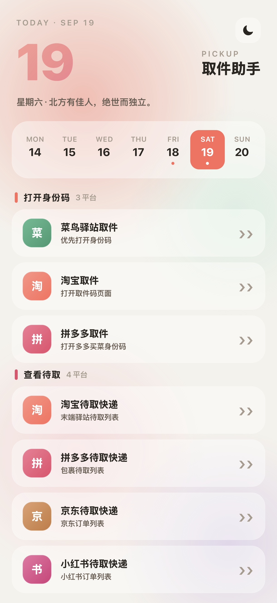
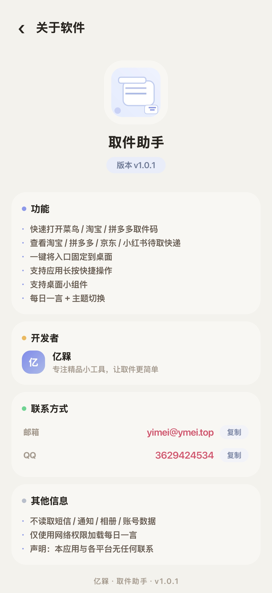
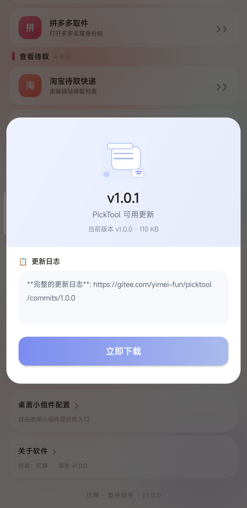
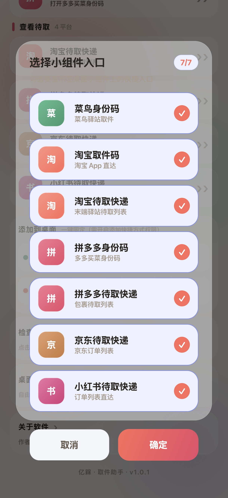

# Pick Tool（取件助手）

> 一键打开你的取件码/身份码。

面向菜鸟 / 淘宝 / 拼多多 / 京东 / 小红书的 Android 取件快捷工具。一键直达取件码 / 身份码页面，零广告、零后台。



---

## ✨ 功能特性

| | |
|---|---|
| 🚀 **一键直达** | 点击即可打开目标 App 的取件码 / 身份码页面 |
| 📦 **7 个入口** | 菜鸟、淘宝取件、淘宝待取、拼多多取件、拼多多待取、京东、小红书 |
| 🔗 **网页兜底** | 目标 App 未安装时，自动打开对应网页版 |
| 📌 **桌面快捷方式** | 长按应用图标 → 4 个固定快捷方式（拼多多/淘宝 × 身份码/取件）|
| 🧩 **桌面小组件** | 8 槽位可缩放小组件，自由勾选要显示的入口（含实时计数选择器）|
| 🔄 **应用内更新** | 有新版本时弹窗 → 应用内下载（圆形进度环）→ 一键安装 |
| 📅 **每日一言** | 每日从 hitokoto.cn 拉取一言，离线时使用内置文案 |
| 🎨 **主题** | 亮色 / 暗色 / 跟随系统，玻璃拟态设计，超圆角 |

## 📸 截图

| 主界面 | 关于软件 | 更新弹窗 | 小组件配置 |
|---|---|---|---|
|  |  |  |  |

## 🛠️ 构建

**环境要求：** JDK 11+、Android SDK 35、build-tools 36.0.0+

### 构建命令

```powershell
# 设置环境变量（指向你的本地路径）
set PICKTOOL_JDK=C:\path\to\jdk-21
set ANDROID_HOME=C:\path\to\android-sdk

# 执行构建
python build_scripts/build_manual.py
```

APK 输出到 `app/build/outputs/apk/debug/`

### 安装到设备

```powershell
adb install -r -t app/build/outputs/apk/debug/app-debug-phone.apk
```

### 构建说明

- 构建脚本 `build_scripts/build_manual.py` 是自包含的，无需 Gradle 依赖
- 路径全部从环境变量读取（`PICKTOOL_JDK` 和 `ANDROID_HOME`），不会泄露本地路径
- 缺少环境变量时脚本会给出明确提示并退出

## 🧩 小组件说明

- 8 槽位、2 行布局，图标**自适应大小**（weight 填充，上限 48 dp）
- 紧凑模式：小组件拖到最小时隐藏入口名称，只显示图标
- `resizeMode="horizontal|vertical"` 让 MIUI/HyperOS 显示缩放手柄

## 🔐 隐私承诺

- **不读取**短信 / 通讯录 / 照片 / 账号
- **唯一 INTERNET 权限**：按需更新检测 + 每日一言
- **无**统计、广告、后台服务
- **纯本地运行**：你的数据不会离开手机

## 🧩 兼容性

- minSdk **23**（Android 6.0 Marshmallow）
- targetSdk **35**（Android 15）
- 已在小米 MIUI / HyperOS 桌面实测

## 📜 开源许可

[MIT](./LICENSE)

---

<p align="center">
  <sub>为所有在 5 个 App 之间翻找取件码及切换身份码的人而做。</sub>
</p>